# Collaborative Effectiveness Reflection

## Selecting a collaborative partner
For this assignment I choose to with my partner, I will refer to her as "M". She acted as the project's client. While I was responsible for the design and technical development and implementation of the Pygame Blackjack Game. She gave me feedback on the choices regarding design, functionality and user accessibility.

## Project overview
The project consisted of creating a Blackjack Game based on a YouTube tutorial. First I followed the tutorial, then I expanded the tutorial with my own creative ideas. I created a card deck and poker chips from scratch using Adobe Illustrator, I choose sounds via [Pixabay](https://pixabay.com/nl/sound-effects/) and researched to use of colours within a casino. This all led to processing the adaptations. M provided feedback and approval on the designs, colours, sounds and visual adaptations. 
We choose [Trello](https://trello.com/) as our primary collaboration tool, in which we kept track of tasks, feedback and approvals. Besides Trello we also held in-person discussions to iterate and discuss progress. 

## Communication
Trello was used a communication tool to keep track of tasks, progress and approvals. Trello was chosen to prevent the use of personal information for M. By using Trello we could use a username en screenshots (see attachments) could be made as proof without compromising any personal informatie of M.
Because of the research I did, we discussed things in-person before she would give her approval. However the approval was given via Trello to maintain a task oriented documentation. One example is the approval for the card deck. After researching luxury and casino colours I figured out black and gold were a powerful combination. I surprised her with the initial look and feel of the cards and she was very exited. I asked if she wanted a different logo on the backside, that wasn't necessary. Most iterations went like that and the final approval (and final design) went through Trello.

This was also the most challenging part, we had too figure out how to make sure we actually added all discussion topics. But we succeeded to do so. I did however was able to dig deeper faster if something was unclear, so it took less time to get a complete answer. 

## Roles and Responsibilities
The roles were very clear. My role was to develop and her role was that of the client. I was able to look at everything from a developers perspective to learn and she could judge everything with a user point of view. 
Dividing the roles wasn't difficult at all, it was very clear from the start what both of us had to do. The part that was difficult for the both of us, was keeping things small. We are both functional application managers for a living and we are used to pushing things to the limit of the programs ability. And in this case, I had to **not** think like a functional application manager. And sometimes had trouble not to become one of the "clients" but stay the designer/developer (student). 

## Teamwork and contribution
Even though most of the work was my responsibility, which makes sense because I'm the student and need the experience, it was a team effort. 
Without the contribution of M it would not have had the same final result. It was thanks to her feedback and decision-making it's this refined. What either of of did, contributed to the overall result of the project and was fitting for the roles we had agreed upon. 

## Lessons Learned (individual)
### Skills developed/improved
* Asking for specific feedback and working iteratively, rather than jumping right in.
* Recording decisions in Trello to keep everything clear for everyone involved. 
* Creating clear and precise agreements about roles and expectations.

### What would I do differently next time
* Summarise verbal feedback in writing to avoid confusion.
* Plan and set check-in moments for a more structured collaboration.

### Insights for future collaborations
* It's not always about the amount of communication, but about being clear and making clear agreements. And documenting those agreements and decisions.
* When working in a informal setting, keeping track of your documentation is important. It's easy to lose sight of this in informal settings.

## Appendices
### Trello

<strong>Trello screenshots</strong> (click to open)

Trello members
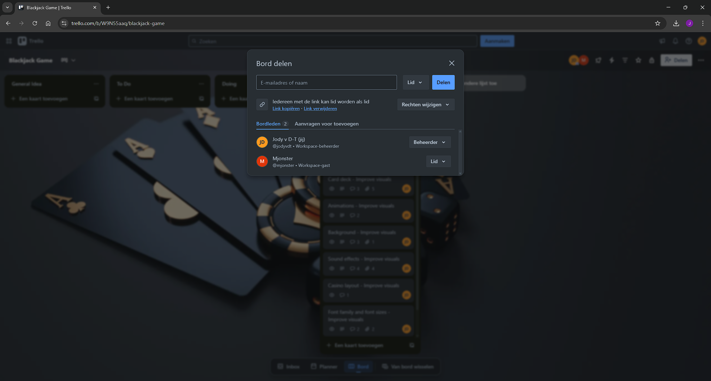 

Trello primary card
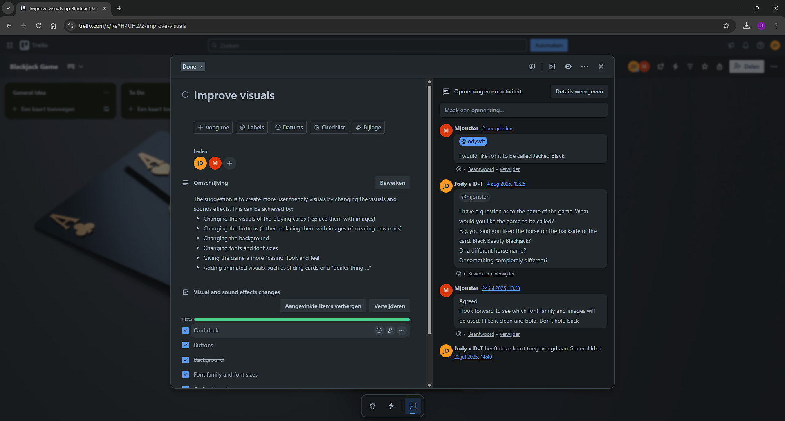 

Trello background
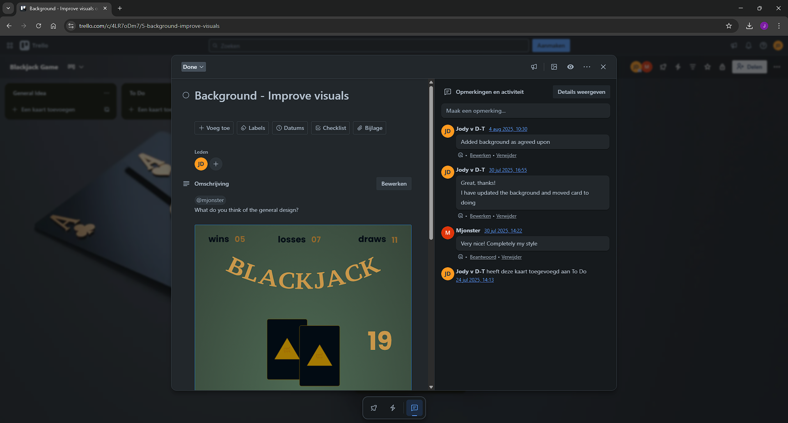 

Trello card deck
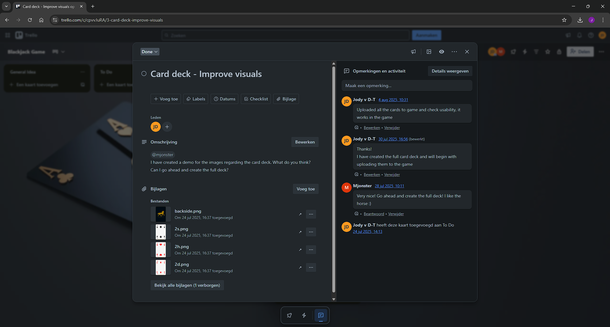 

Trello font families
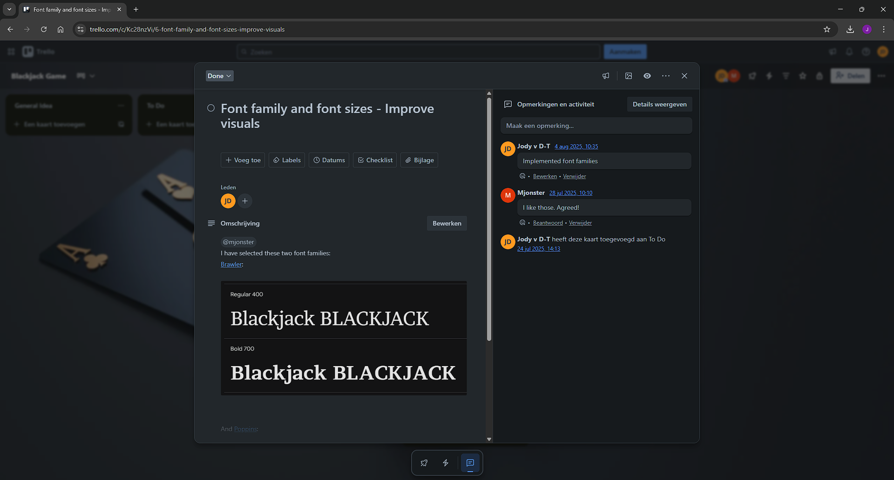 

Trello sound effects
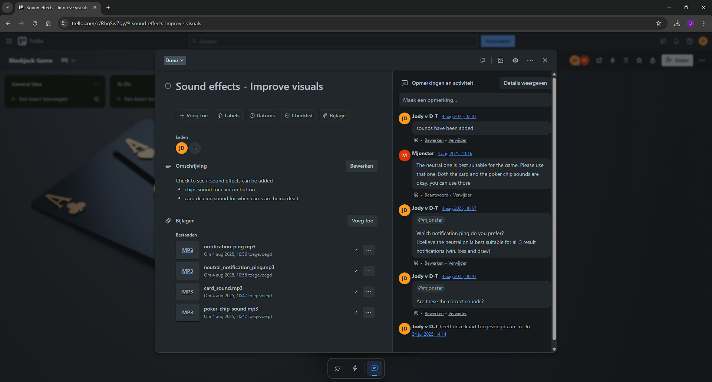 

Trello test game
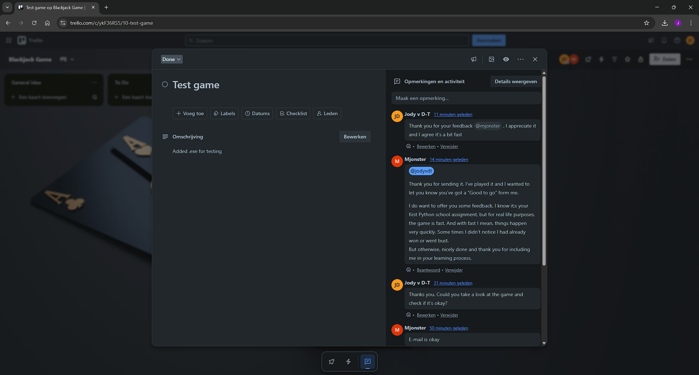 

### Design

<strong>Design images</strong> (click to open)

General design

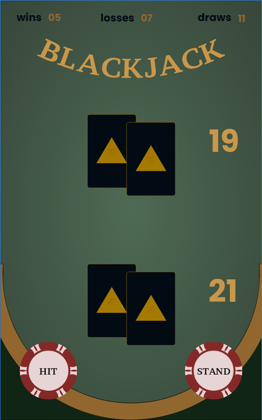 

Backside of card design
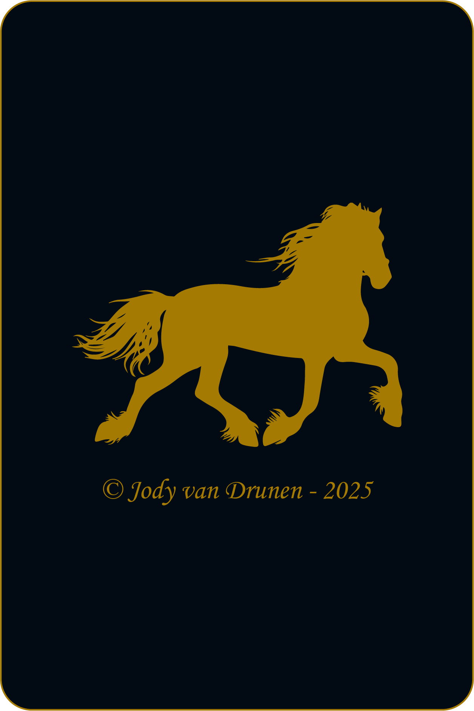 

Queen of Hearts
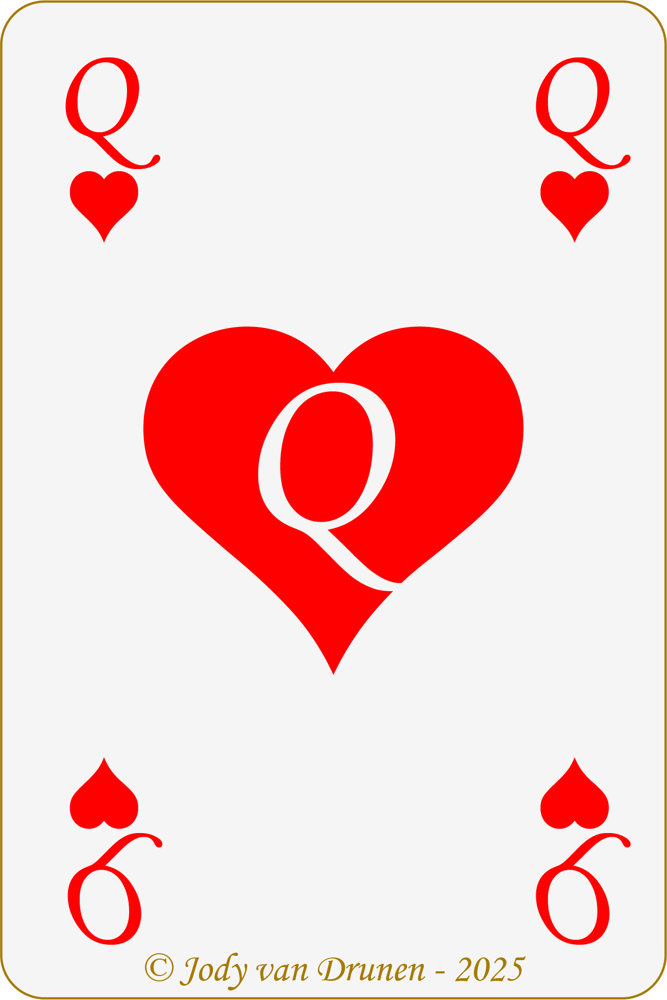 

Ace of Spades
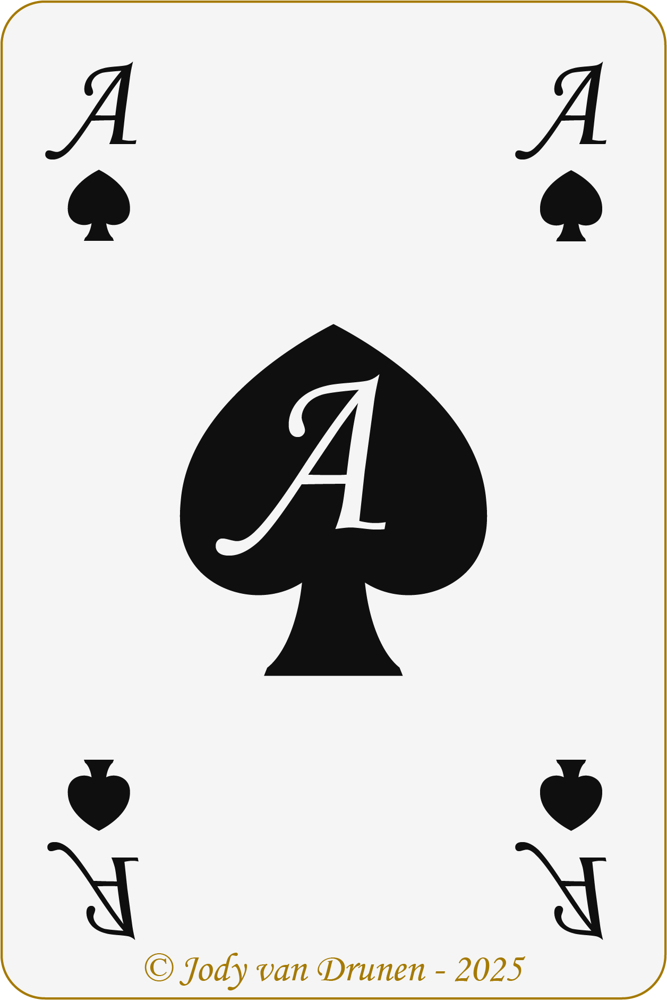 

King of Diamonds
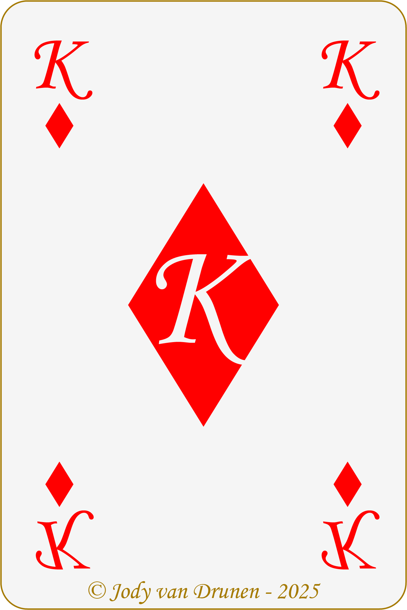 

Jack of Clubs
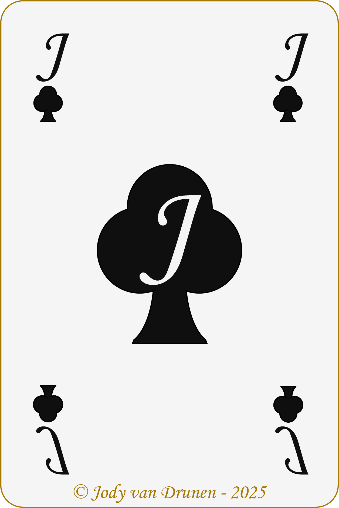 

Poker chip
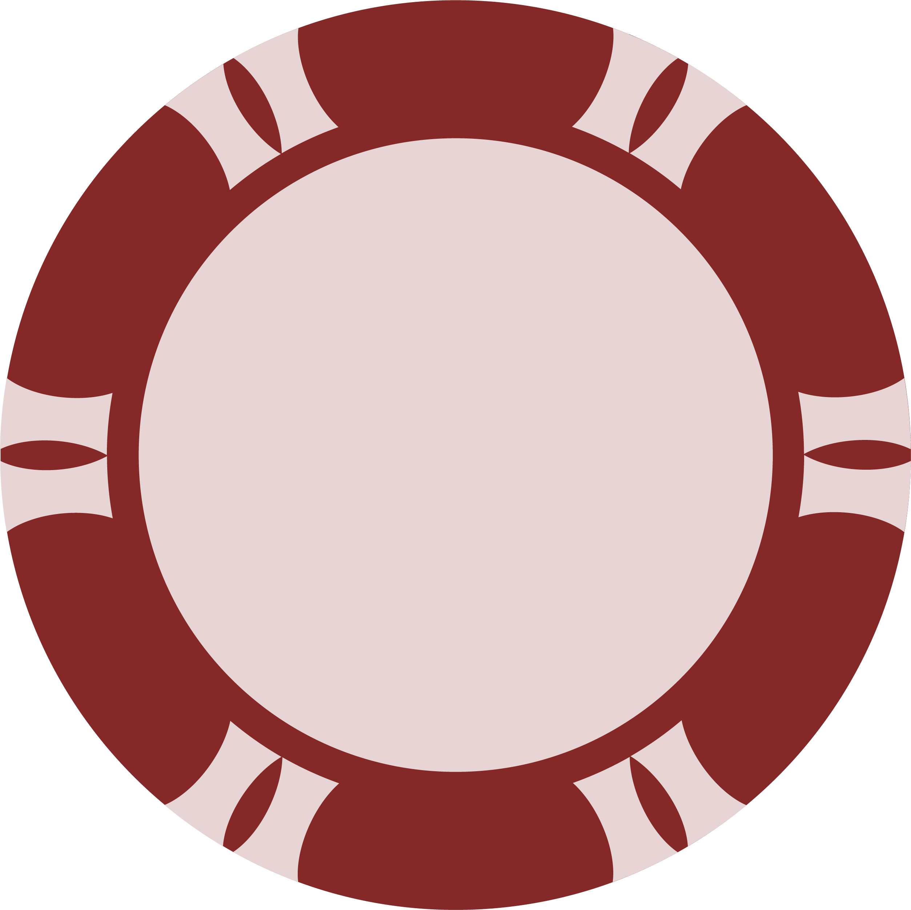 

